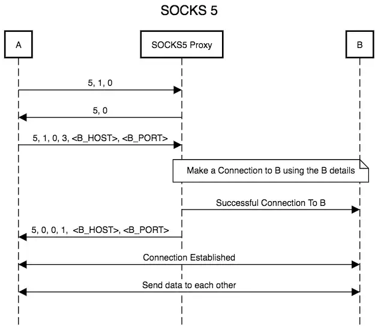

# What is this?

This is a Node.js project designed to validate a list of proxy servers. The primary purpose of this tool is to filter out a public list of proxy servers by reading the IP and port from a .txt file, connecting to each proxy, downloading a file, and measuring the throughput. This way, you can easily identify and keep only the most reliable and fastest proxies for your purposes.

Prerequisites
Before you begin, ensure you have met the following requirements:

You have installed Node.js and npm. You can download and install Node.js from their official website.
You have a .txt file with the list of proxies in the format ip:port, one per line.


## Where I can get a list of the public proxies?
To get a list of public prxoies I have used [proxy-lists](https://github.com/chill117/proxy-lists). It generates a `proxies.txt` that this vlaidator tests then.

## Which proxy protocols this project can validate?
- SOCKS4
- SOCKS5
- HTTP
- HTTP CONNECT

## Socks5


1. The First Byte 0x05 is for the version of the SOCKS, in this case, it is SOCKS 5. This remains common for all the SOCKS 5 packets. Won’t mention this byte in next sections. The Second Byte 0x01 is for authentication purposes. Precisely, the number of authentication methods supported by the client. Here 0x01 means one method is supported. The Third Byte 0x00 is for the authentication methods. There are authentication methods, variable length, 1 byte per method supported. The authentication methods supported are numbered as follows:

2. SOCKS Proxy sends back to A(0x05, 0x00). The Second Byte 0x00 is the chosen authentication method by the proxy. In this case, it was the only method provided by the client hence this. The subsequent authentication is method-dependent. Username and password authentication(method 0x02) is described in RFC 1929. Here no authentication dependent steps need to take place further. If the negotiated method includes encapsulation for purposes of integrity checking and/or confidentiality, further requests MUST be encapsulated in the method-dependent encapsulation.

3. A(Client) sends the request packet (0x05, 0x01, 0x00, 0x03, <B_HOST>, <B_PORT>). Once the method-dependent subnegotiation has completed, the client sends the request details to SOCKS proxy.
- The Second Byte 0x01 is for the command code. It is one byte
0x01: establish a TCP/IP stream connection
0x02: establish a TCP/IP port binding
0x03: associate a UDP port
- The Third Byte 0x00 is a reserved byte. It must be 0x00 and 1 byte.
- The Fourth Byte 0x03 is the address type of desired HOST and 1 byte. The options are as below.
0x01: IPv4 address, followed by 4 bytes IP
0x03: Domain name, 1 byte for name length, followed by host name
0x04: IPv6 address, followed by 16 bytes IP
- The last Byte is port number in a network byte order, 2 bytes

4. SOCKS proxy sends back the request packet (0x05, 0x00, 0x00, 0x01, <B_HOST>, <B_PORT>). This is for the status of the request by the client to the proxy

- The Second Byte 0x00 is the status field. It is one byte. Meaning the request was granted.
- The Third Byte 0x00 is a reserved byte. It must be 0x00 and 1 byte.
- he Fourth Byte 0x01 is the address type of desired HOST and 1 byte. In case of CONNECT, this is followed by the binded IP address for the desired HOST, to give the client the detail of the DNS resolution.
-   The last Byte is port number in a network byte order, 2 bytes


## Localhost Testing

To test a Socks4 and Socks5 proxies, I used
```bash
ssh -D 1080 -C -q -N $SSH_HOST
```

For the HTTP and HTTP CONNECT proxies I have used [switchproxy](https://github.com/dzianisv/switchproxy)

## Convertation
`{ip, port, protocol}` to `protocol://ip:port`

```bash
jq -j -r '.protocol, "://", .ip, ":", .port, "\n"' < validated.json
```

## Notes
1. It is better to use HTTPS endpoint to test HTTP proxies for HTTP CONNECT support.


## Installation to OrangePi
```bash
rsync --progress -rtl --exclude=node_modules *  root@orangepi4-lts:~/proxy-validator/
```